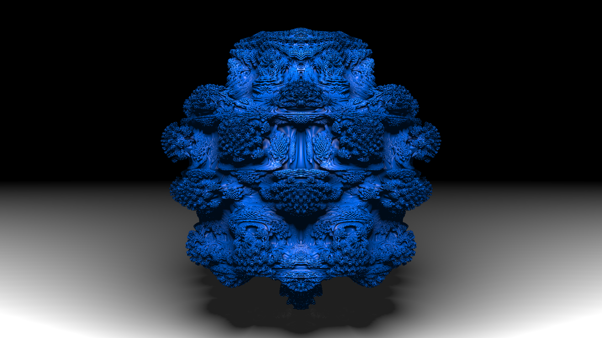
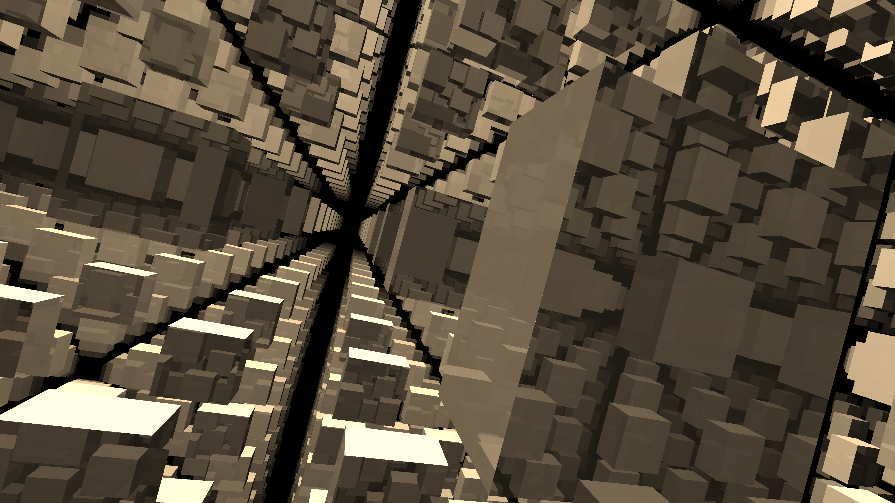
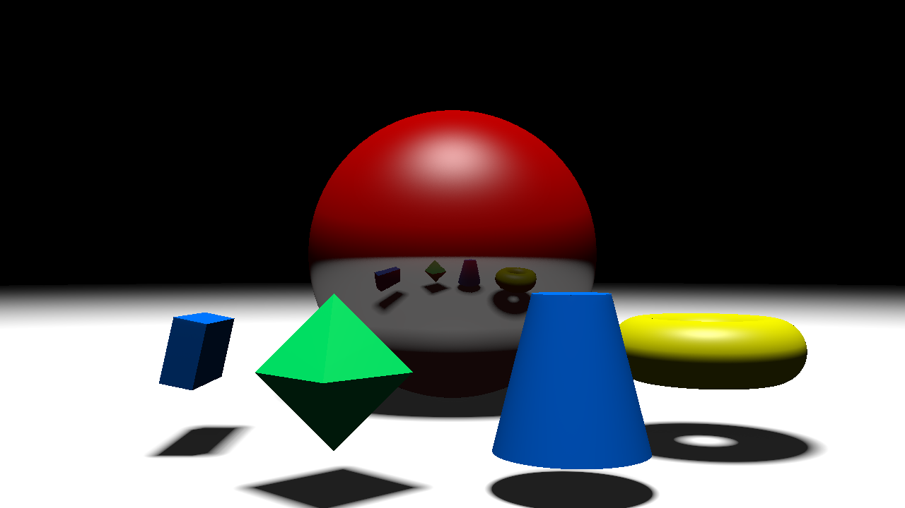

# Ray Marcher



Implementation of a fast ray marcher based on sphere tracing.


# How to compile and run
### Dependencies
No dependencies are required to run our raymarcher. 
Everything is self-contained.

### Compile
First compile the project by running these commands from the root directory:
```
cd build
make
```

A file called `raymarcher` will be created.



### Run
In the build folder run `./raymarcher`.
After the execution the output will be placed into the `output` directory.

### Compile and Run
If you want to simply compile and run all the predefined scenes, then run the following:

On UNIX:
```console
team049$ cd build
team049/build$ bash run_raymarcher.sh 
```

### Scenes
A Scene is composed of geometric shapes that are each defined by a *signed distance function*.
The combination of all these shapes creates a *signed distance space*. Our raymarcher algorithm is then applied on this space.

The creation of a scene is defined via a JSON file that gets parsed via a custom JSON parser.
With this pipeline we built you can create and customize any scene you want.

The currently available scenes are in the team049/scenes/ folder.




## Authors
**Nihat Isik - (github: devnio)**

**Qais El Okaili - (github: Xemno)**

**Alexandre Cavaleri - (github: cavEpfl)** 

**David Graf  - (github: fxd24)**

Note that some commits were done on computers with different global git configurations, which ultimately resulted in commits authored by our github (and not gitlab) user names. 
For the sake of clarity we attach the github name on the right of each team member name.
