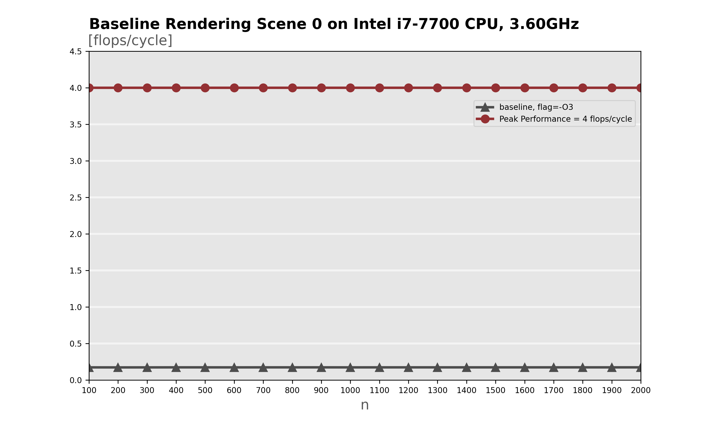
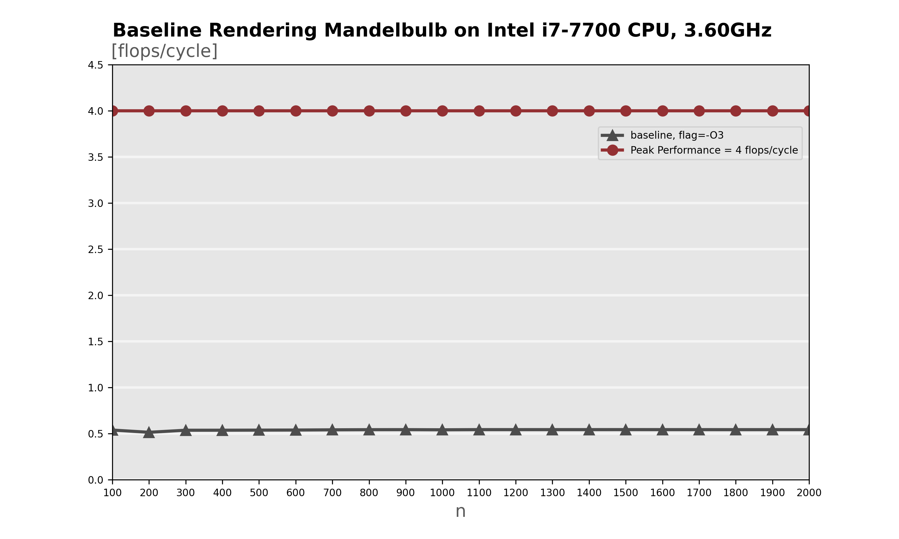
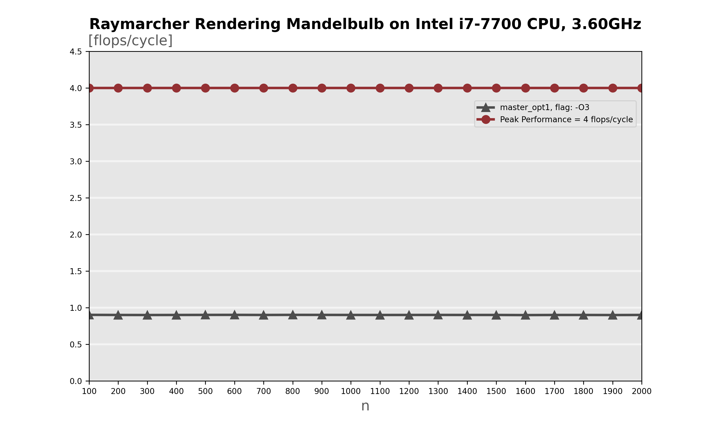
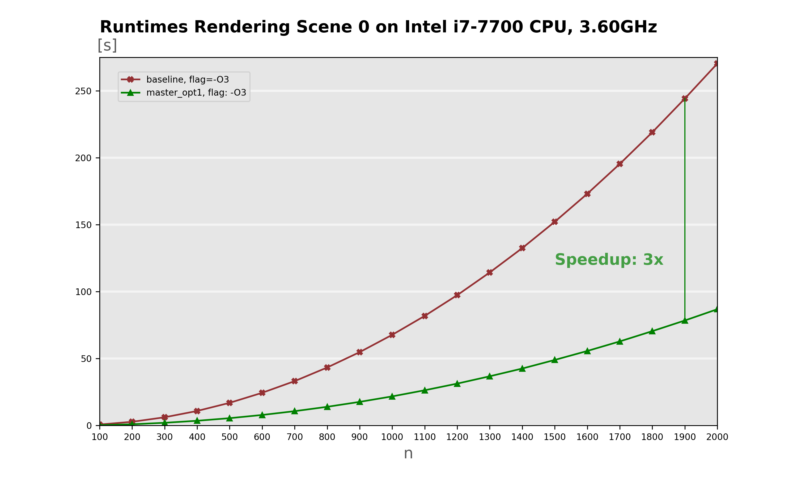
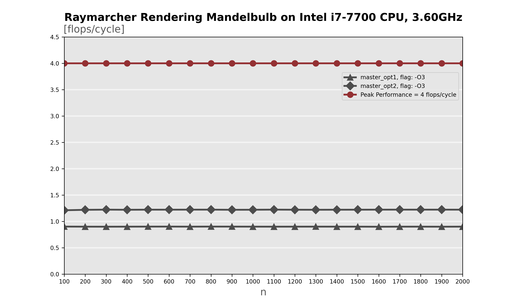
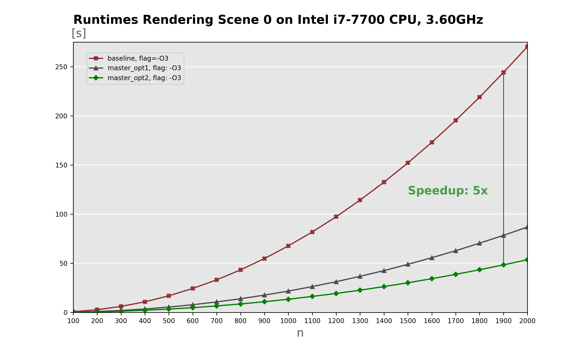
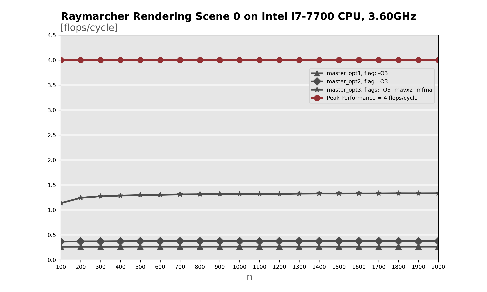

# Plots

- For each baseline we count our flops using a custom codebase that stores call counts and multiplies these by the manually counted flops per function in a huge automated excel sheet.

- We benchmark our code as seen in class.

- The n variable represents the height of the output image. This is used together with the aspect ratio to compute the width and run the raymarcher. 

- Our range is n={100, ..., 2000}.

- For every n we run the benchmark 4 times and store the data in a .csv file. The final cycle count for each n is given by the average of the 4 values. These values were chosen in order to have enough accuracy, enough computation for the cpu aswell as a reasonable benchmark time.

- We benchmark on 2 defined scenes: `scene0` which contains all shapes except the mandelbulb, and `mandelbulb` which contains the mandelbulb and a plane. This combination was chosen in order to have full primitive rendering coverage.

As an example running a full session of benchmarking for a single scene for our first baseline requires 3h to 6h depending on the machine.

In the following list we show the performance plots and runtime plots for a Intel i7-7700 CPU, 3.60GHz (4.2 w. TB) machine.	
## Phase 0

Performance plots of our baseline for scene0 and mandelbulb.

  
   

## Phase 1

Performance plots of phase1. Here the flop count reduced significantly because of some precomputation we managed to achieve as well as other global optimizations which made our program less compute and memory bound.

  
   

Runtime plots of the baseline and phase1 for scene0 and mandelbulb. We also show the speedup we achieved.

  
   

## Plot 2
Performance plots of phase2.

  
   

Runtime plots of baseline, phase1 and phase2 for scene0 and mandelbulb. We also show the respective speedup from the clean baseline to the last phase.

  
   

## Phase 3
Performance plots of phase3.

  
   

Runtime plots of baseline, phase1, phase2 and phase3 for scene0 and mandelbulb.  We also show the respective speedup from the clean baseline to the last one.

  
   

>>>
More detailed explanations and analysis are explained in the presentation and the report.
>>>

# Timeline Overview

Here we show a rough timeline overview which is locally matched with documents for each phase of optimization that goes into more detail.
We kept this to have a more high level overview of our progress and next steps.

- Each phase is formed by a table.

- Each table has a parent name at the top, e.g. master (which is our baseline).

- The next elements represent the childs which are the optimizations that will be branched off of the parent (e.g. 1. Rotate_point).

- The successfully completed ones go to the next stage and form the new parent (hence new table).

- On top of each table we have the due date for the conclusion of that phase (meaning all the child optimizations for the previous phase have to be completed for that date).

