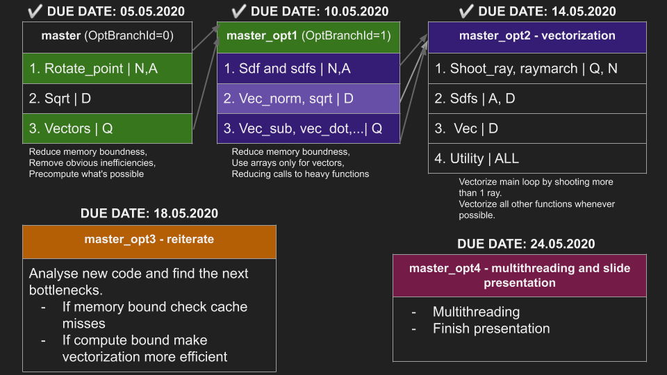

# Plots

>>>
These are the plots for our first three baselines. 
The plots will be refined and improved at the end of our optimization sessions.
>>>

- For each baseline we count our flops using a custom codebase that stores call counts and multiplies these by the manually counted flops per function in a huge automated excel sheet.

- We benchmark our code as seen in class.

- The n variable represents the height of the output image. This is used together with the aspect ratio to compute the width and run the raymarcher. 

- Our range is n={100, ..., 2000}.

- For every n we run the benchmark 4 times and store the data in a .csv file. The final cycle count for each n is given by the average of the 4 values. These values were chosen in order to have enough accuracy, enough computation for the cpu aswell as a reasonable benchmark time.

- We benchmark on 2 defined scenes: `scene0` which contains all shapes except the mandelbulb, and `mandelbulb` which contains the mandelbulb and a plane. This combination was chosen in order to have full primitive rendering coverage.

As an example running a full session of benchmarking for a single scene for our first baseline requires 3h to 6h depending on the machine.

## Plot 1

Performance plot of our first baseline.

## Plot 2

Performance plot of our second baseline. Here the flop count reduced significantly because of some precomputation we managed to achieve aswell as other global optimizations which made our program less compute and memory bound.

## Plot 3

Performance plot of our third baseline. 

>>>
More detailed explanations and analysis will be shown at the end of our optimizations.
>>>

# Timeline Overview

Here we show a rough timeline overview which is locally matched with documents for each phase of optimization that goes into more detail.
We kept this to have a more high level overview of our progress and next steps.

- Each phase is formed by a table.

- Each table has a parent name at the top, e.g. master (which is our baseline).

- The next elements represent the childs which are the optimizations that will be branched off of the parent (e.g. 1. Rotate_point).

- The successfully completed ones go to the next stage and form the new parent (hence new table).

- On top of each table we have the due date for the conclusion of that phase (meaning all the child optimizations for the previous phase have to be completed for that date).

